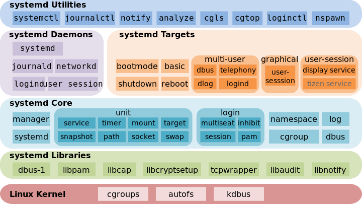

[TOC]

## 架构




## Unit 抽象

systemd管理的所有计算机资源被抽象为Unit，包含12种类：

| **后缀名**     | **作用**                                                     |
| -------------- | ------------------------------------------------------------ |
| **.automount** | 用于控制自动挂载文件系统。自动挂载即当某一目录被访问时系统自动挂载该目录，这类 unit 取代了传统 Linux 系统的 autofs 相应功能 |
| **.device**    | 对应 /dev 目录下设备，主要用于定义设备之间的依赖关系         |
| **.mount**     | 定义系统结构层次中的一个挂载点，可以替代过去的 /etc/fstab 配置文件 |
| **.path**      | 用于监控指定目录变化，并触发其他 unit 运行                   |
| **.scope**     | 这类 unit 文件不是用户创建的，而是 Systemd 运行时自己产生的，描述一些系统服务的分组信息 |
| **.service**   | 封装守护进程的启动、停止、重启和重载操作，是最常见的一种 unit 类型 |
| **.slice**     | 用于描述 cgroup 的一些信息，极少使用到，一般用户就忽略它吧   |
| **.snapshot**  | 这种 unit 其实是 systemctl snapshot 命令创建的一个描述 Systemd unit 运行状态的快照 |
| **.socket**    | 监控系统或互联网中的 socket 消息，用于实现基于网络数据自动触发服务启动 |
| **.swap**      | 定义一个用于做虚拟内存的交换分区                             |
| **.target**    | 用于对 unit 进行逻辑分组，引导其他 unit 的执行。它替代了 SysV 中运行级别的作用，并提供更灵活的基于特定设备事件的启动方式。例如 multi-user.target 相当于过去的运行级别5，而 bluetooth.target 在有蓝牙设备接入时就会被触发 |
| **.timer**     | 封装由system的里面由时间触发的动作, 替代了 crontab 的功能    |


使用`systemctl list-units`可以看到系统全部的Unit

```bash
# ---------查看系统的Unit----------------------

# 列出正在运行的 Unit
$ systemctl list-units

# 列出所有Unit，包括没有找到配置文件的或者启动失败的
$ systemctl list-units --all

# 列出所有没有运行的 Unit
$ systemctl list-units --all --state=inactive

# 列出所有加载失败的 Unit
$ systemctl list-units --failed

# 列出所有正在运行的、类型为 service 的 Unit
$ systemctl list-units --type=service

# --------Unit状态--------------------
# 显示某个 Unit 是否正在运行
$ systemctl is-active application.service

# 显示某个 Unit 是否处于启动失败状态
$ systemctl is-failed application.service

# 显示某个 Unit 服务是否建立了启动链接
$ systemctl is-enabled application.service

# ------------Unit 启停 ------------------------
# 立即启动一个服务
$ sudo systemctl start apache.service

# 立即停止一个服务
$ sudo systemctl stop apache.service

# 重启一个服务
$ sudo systemctl restart apache.service

# 杀死一个服务的所有子进程
$ sudo systemctl kill apache.service

# 重新加载一个服务的配置文件
$ sudo systemctl reload apache.service

# 重载所有修改过的配置文件
$ sudo systemctl daemon-reload

# 显示某个 Unit 的所有底层参数
$ systemctl show httpd.service

# 显示某个 Unit 的指定属性的值
$ systemctl show -p CPUShares httpd.service

# 设置某个 Unit 的指定属性
$ sudo systemctl set-property httpd.service CPUShares=500

# ----------展示依赖关系------------
$ systemctl list-dependencies --all nginx.service
```


## 配置文件

关于配置文件更详细的写法参考：

- <https://blog.csdn.net/shuaixingi/article/details/49641721>
- <https://www.freedesktop.org/software/systemd/man/systemd.service.html>
- 

### Unit文件位置

systemd默认读取配置的目录是`/etc/systemd/system`，里面大部分的文件是软连接，真正的文件放在 `/usr/lib/systemd/system/`

按照 Systemd 约定，应该被放置在指定的3个系统目录之一。这3个目录是有优先级的，依照下面表格，越靠上的优先级越高，因此在几个目录中有同名文件的时候，只有优先级最高的目录里的那个会被使用。

| **路径**                    | **说明**                             |
| --------------------------- | ------------------------------------ |
| **/etc/systemd/system**     | 系统或用户提供的配置文件             |
| **/run/systemd/system**     | 软件运行时生成的配置文件             |
| **/usr/lib/systemd/system** | 系统或第三方软件安装时添加的配置文件 |

```bash
# 设置开机启动
$ sudo systemctl enable xx.service

# 禁止开机启动 
$ sudo systemctl disable xx.service


# 列出所有配置文件
$ systemctl list-unit-files

# 列出指定类型的配置文件
$ systemctl list-unit-files --type=service
```


### Unit 文件后缀

每个文件后缀根据用途可以是Unit抽象一节中的12个类型后缀


### Unit配置文件状态

- enabled：已建立启动链接
- disabled：没建立启动链接
- static：该配置文件没有`[Install]`部分（无法执行），只能作为其他配置文件的依赖
- masked：该配置文件被禁止建立启动链接


从配置文件状态你无法看出一个Unit是否在运行，如果要看是否运行可以执行

```bash
$systemctl status bluetooth.service
```


### 修改、新加配置文件启动

```bash
$ sudo systemctl daemon-reload
$ sudo systemctl restart httpd.service
```


### Unit 文件的书写格式

文件的整体格式类似：

```ini
[Unit]
Description=ATD daemon

[Service]
Type=forking
ExecStart=/usr/bin/atd

[Install]
WantedBy=multi-user.target
```


1. `[Unit]`区块通常是配置文件的第一个区块，用来定义 Unit 的元数据，以及配置与其他 Unit 的关系。它的主要字段如下。

   - `Description`：简短描述
   - `Documentation`：文档地址
   - `Requires`：当前 Unit 依赖的其他 Unit，如果它们没有运行，当前 Unit 会启动失败
   - `Wants`：与当前 Unit 配合的其他 Unit，如果它们没有运行，当前 Unit 不会启动失败
   - `BindsTo`：与`Requires`类似，它指定的 Unit 如果退出，会导致当前 Unit 停止运行
   - `Before`：如果该字段指定的 Unit 也要启动，那么必须在当前 Unit 之后启动
   - `After`：如果该字段指定的 Unit 也要启动，那么必须在当前 Unit 之前启动
   - `Conflicts`：这里指定的 Unit 不能与当前 Unit 同时运行
   - `Condition...`：当前 Unit 运行必须满足的条件，否则不会运行
   - `Assert...`：当前 Unit 运行必须满足的条件，否则会报启动失败

   

2. `[Service]`区块用来 Service 的配置，只有 Service 类型的 Unit 才有这个区块。它的主要字段如下。

   - `Type`：定义启动时的进程行为。它有以下几种值。
   - `Type=simple`：默认值，执行`ExecStart`指定的命令，启动主进程
   - `Type=forking`：以 fork 方式从父进程创建子进程，创建后父进程会立即退出
   - `Type=oneshot`：一次性进程，Systemd 会等当前服务退出，再继续往下执行
   - `Type=dbus`：当前服务通过D-Bus启动
   - `Type=notify`：当前服务启动完毕，会通知`Systemd`，再继续往下执行
   - `Type=idle`：若有其他任务执行完毕，当前服务才会运行
   - `ExecStart`：启动当前服务的命令
   - `ExecStartPre`：启动当前服务之前执行的命令
   - `ExecStartPost`：启动当前服务之后执行的命令
   - `ExecReload`：重启当前服务时执行的命令
   - `ExecStop`：停止当前服务时执行的命令
   - `ExecStopPost`：停止当其服务之后执行的命令
   - `RestartSec`：自动重启当前服务间隔的秒数
   - `Restart`：定义何种情况 Systemd 会自动重启当前服务，可能的值包括`always`（总是重启）、`on-success`、`on-failure`、`on-abnormal`、`on-abort`、`on-watchdog`
   - `TimeoutSec`：定义 Systemd 停止当前服务之前等待的秒数
   - `Environment`：指定环境变量

   

3. `[Install]`通常是配置文件的最后一个区块，用来定义如何启动，以及是否开机启动。它的主要字段如下。

   - `Description`：简短描述
   - `Documentation`：文档地址
   - `Requires`：当前 Unit 依赖的其他 Unit，如果它们没有运行，当前 Unit 会启动失败
   - `Wants`：与当前 Unit 配合的其他 Unit，如果它们没有运行，当前 Unit 不会启动失败
   - `BindsTo`：与`Requires`类似，它指定的 Unit 如果退出，会导致当前 Unit 停止运行
   - `Before`：如果该字段指定的 Unit 也要启动，那么必须在当前 Unit 之后启动
   - `After`：如果该字段指定的 Unit 也要启动，那么必须在当前 Unit 之前启动
   - `Conflicts`：这里指定的 Unit 不能与当前 Unit 同时运行
   - `Condition...`：当前 Unit 运行必须满足的条件，否则不会运行
   - `Assert...`：当前 Unit 运行必须满足的条件，否则会报启动失败

   

   更具体的参数详解： <https://blog.csdn.net/shuaixingi/article/details/49641721>

   

   ## Target

   Target 就是一个 Unit 组，包含许多相关的 Unit 。启动某个 Target 的时候，Systemd 就会启动里面所有的 Unit。

   

   

   

   ## 日志管理

   Systemd 统一管理所有 Unit 的启动日志。带来的好处就是，可以只用`journalctl`一个命令，查看所有日志（内核日志和应用日志）。日志的配置文件是`/etc/systemd/journald.conf`。

   ```bash
   # 查看所有日志（默认情况下 ，只保存本次启动的日志）
   $ sudo journalctl
   
   # 查看内核日志（不显示应用日志）
   $ sudo journalctl -k
   
   # 查看系统本次启动的日志
   $ sudo journalctl -b
   $ sudo journalctl -b -0
   
   # 查看上一次启动的日志（需更改设置）
   $ sudo journalctl -b -1
   
   # 查看指定时间的日志
   $ sudo journalctl --since="2012-10-30 18:17:16"
   $ sudo journalctl --since "20 min ago"
   $ sudo journalctl --since yesterday
   $ sudo journalctl --since "2015-01-10" --until "2015-01-11 03:00"
   $ sudo journalctl --since 09:00 --until "1 hour ago"
   
   # 显示尾部的最新10行日志
   $ sudo journalctl -n
   
   # 显示尾部指定行数的日志
   $ sudo journalctl -n 20
   
   # 实时滚动显示最新日志
   $ sudo journalctl -f
   
   # 查看指定服务的日志
   $ sudo journalctl /usr/lib/systemd/systemd
   
   # 查看指定进程的日志
   $ sudo journalctl _PID=1
   
   # 查看某个路径的脚本的日志
   $ sudo journalctl /usr/bin/bash
   
   # 查看指定用户的日志
   $ sudo journalctl _UID=33 --since today
   
   # 查看某个 Unit 的日志
   $ sudo journalctl -u nginx.service
   $ sudo journalctl -u nginx.service --since today
   
   # 实时滚动显示某个 Unit 的最新日志
   $ sudo journalctl -u nginx.service -f
   
   # 合并显示多个 Unit 的日志
   $ journalctl -u nginx.service -u php-fpm.service --since today
   
   # 查看指定优先级（及其以上级别）的日志，共有8级
   # 0: emerg
   # 1: alert
   # 2: crit
   # 3: err
   # 4: warning
   # 5: notice
   # 6: info
   # 7: debug
   $ sudo journalctl -p err -b
   
   # 日志默认分页输出，--no-pager 改为正常的标准输出
   $ sudo journalctl --no-pager
   
   # 以 JSON 格式（单行）输出
   $ sudo journalctl -b -u nginx.service -o json
   
   # 以 JSON 格式（多行）输出，可读性更好
   $ sudo journalctl -b -u nginx.serviceqq
    -o json-pretty
   
   # 显示日志占据的硬盘空间
   $ sudo journalctl --disk-usage
   
   # 指定日志文件占据的最大空间
   $ sudo journalctl --vacuum-size=1G
   
   # 指定日志文件保存多久
   $ sudo journalctl --vacuum-time=1years
   ```

   

    