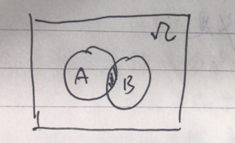

tags:贝叶斯分类
    贝叶斯公式
    朴素贝叶斯

[TOC]

## 朴素贝叶斯

### 公式理解

$$
P(B|A)=\frac{P(A|B)P(B)}{P(A)} \tag{1}
$$

如果把上面这个公式换个形式就是：
$$
P(类别|特征) = \frac{P(特征|类别)P(类别)}{P(特征)}\tag{2}
$$

现实生活中有很多例子可以用朴素贝叶斯解决，例如一个女生拿到了男生的一些信息（身高=矮，帅否=不帅，性格好=差，上进心=不上进），如何判断是否值得嫁。

这是一个事先知道很多条件（特征），要做出决策（分类：嫁/不嫁）的问题。

如何决策？其实最简单的就是参考历史数据，怎么评价呢？

> （身高=矮，帅否=不帅，性格好=差，上进心=不上进）这样的人既有选择嫁的也有选择不嫁的。只需要看这种男生里，多大比例的女生选择了【嫁】。

上述方法用公式描述就是
$$
P(嫁|矮，不帅，性格差，不上进)=\frac{P（矮，不帅，性格差，不上进|嫁）*P(嫁)}{P（矮，不帅，性格差，不上进）}
$$
我们用`矮矬穷`标识这个男生，用恶俗一点的语言描述下上面的公式就是：
$$
P(决定要嫁给矮矬穷的概率)=\frac{已经嫁出去的女生中选择了矮矬穷的比例}{谈婚论嫁的全部矮矬穷的比例}
$$

### 场景化说明

有100个男生（其中有30个矮矬穷）和100女参与相亲。最后一共结合成80对，其中10个矮矬穷找到了对象。女生该把这个男生分类为`嫁`, 还是`不嫁`？

于是:

$$
\begin{align}
P(嫁)=\frac{80}{100}\tag{1}  \\
P(矮矬穷|嫁)=已经嫁出去的女生中选择了矮矬穷的比例=\frac{10}{80}\tag{2}  \\
P(矮矬穷）=谈婚论嫁的全部矮矬穷的比例 = \frac{30}{100}\tag{3}
\end{align}
$$

这样女生最终决策（嫁给矮矬穷的概率）为:
$$
P(矮矬穷|嫁)=\frac{(80/100)*(10/80)}{30/100}=33.33\%
$$

这个地方有人可能会有疑问：直接算矮矬穷里多少人被嫁了不就行了，干嘛搞这么复杂的计算？

> 让我想想。。。

### 贝叶斯公式推导

贝叶斯公式的推导是3个数学概念的结合：

1. 条件概率
2. 乘法公式
3. 全概率公式

#### 1）条件概率

条件概率的公式是： 

$$
\begin{align}
P(B|A)=\frac{P(AB)}{P(A)} \tag{1} \\
P(A|B)=\frac{P(AB)}{P(B)} \tag{2} \\
\end{align}
$$

结合上图分别解释下公式里的意义。

1. P(B|A) 字面上看就是在A已经发生的情况下，B发生的概率。在上图中就是A圆圈里的阴影部分占A的面积。是把B发生的可能空间缩小到了A中。
2. 用通俗语言把条件概率重写一些就是$P(B|A)=\frac{阴影面积}{A的面积}=\frac{阴影面积/\Omega}{A面积/\Omega}=\frac{P(AB)}{P(A)}$

#### 2）乘法公式

由条件概率公式（1）和公式（2）可得
$$
\begin{align}
P(AB)=P(A)*P(B|A) \tag{1} \\
P(AB)=P(B)*P(A|B) \tag{2}
\end{align}
$$

根据上式可得：
$$
P(AB)=P(A)*P(B|A)=P(B)*P(A|B)
$$
于是：
$$
\begin{align}
P(B|A)=\frac{P(B)*P(A|B)}{P(A)} \\
P(A|B)=\frac{P(A)*P(B|A)}{P(B)}
\end{align}
$$

如果事件不止有A、B这2个，而是有多个呢？

扩展到多个变量得到乘法公式：

$$
P(A_1A_2A_3...A_n)=P(A_1)*P(A_2|A_1)*P(A_3|A_1A_2)...P(A_n|A_1A_2..A_{n-1})
$$
这个公式咋得到的呢，就是用最基本的 $P(AB)=P(A)*P(B|A)=P(B)*P(A|B)$得到的，举个3变量的例子：
$$
P(ABC)=P(AB*C)=P(AB)*P(C|AB) \\
= P(A)*P(B|A)*P(C|AB)
$$

#### 3）全概率公式

$C_1,C_2,C_3,C_4$互不相容，且$\bigcup_{i=1}^{4}C_i=\Omega$。

则 全概率公式为：
$$
P(A)=\sum_{i=1}^nP(A_iC)
$$

#### 综上推导

假设有 $x_1, x_2, x_3...x_n, C_i$ 其中$i\in1..m$且$\sum_1^mP(C_i)=1$

对应到实际问题就是：我们喜欢**以貌取人**,那么如何判断得更准确避免走眼呢？

如果你把 $x_1 到 x_n$看做是人的一些外在属性[皮肤，身材，穿着，言谈，发型...], $C_i$看成是你把这个人分成的社会层级{贫穷，一般，小康，中产，富裕，权贵}

这个问题中哪些是已经可以通过统计的出来的经验值呢？

- $P(C_i)$也就是各个社会阶层大概占的比例是多少
- $P(x_1,x_2,...,x_n|C_i)$统计出每个阶层中的这种属性的人的比例
- 1
- 1

我们要求的答案形式是：
$$
P(C_i|x_1,x_2,x_3...x_n)
$$
公式说大白话就是`来了一个人，我看到他[皮肤=白如雪，身材=微胖，穿着=铭牌，言谈=气质，发型=前卫]，那么他到底是哪一类社会阶层呢，[贫穷？一般？小康？中产？富裕？权贵？]`

我们只需要求出下面几个值，然后看概率最大的，把这个人列入这个概率最大的分类即可：
$$
P(贫穷|皮肤=白如雪，身材=微胖，穿着=铭牌，言谈=气质，发型=前卫)=P_1 \\
P(一般|皮肤=白如雪，身材=微胖，穿着=铭牌，言谈=气质，发型=前卫)=P_2 \\
P(小康|皮肤=白如雪，身材=微胖，穿着=铭牌，言谈=气质，发型=前卫)=P_3 \\
P(中产|皮肤=白如雪，身材=微胖，穿着=铭牌，言谈=气质，发型=前卫)=P_4 \\
P(富裕|皮肤=白如雪，身材=微胖，穿着=铭牌，言谈=气质，发型=前卫)=P_5 \\
P(权贵|皮肤=白如雪，身材=微胖，穿着=铭牌，言谈=气质，发型=前卫)=P_6 \\
$$

$$
P(C_i|x_1,x_2,x_3...x_n)=\frac{P(C_i,x_1,x_2,...x_n)}{P(x_1,x_2,...,x_n)} \\
=\frac{P(C_i)*P(x_1,x_2,...,x_n|C_i)}{P(x_1,x_2,...,x_n)} \\
= \frac{P(C_i)*P(x_1,x_2,...,x_n|C_i)}{\sum_{i=1}^{6}P(x_1,x_2,...,x_n|C_i)}
$$

## 半朴素贝叶斯

## 贝叶斯网络

## 参考文章

- https://www.cnblogs.com/pinard/p/6069267.html
- 

