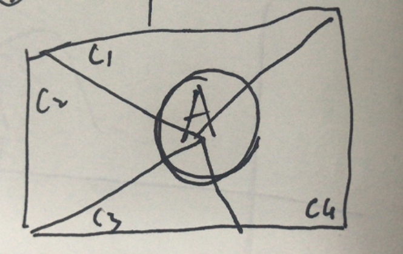

tags:贝叶斯分类
    贝叶斯公式
    朴素贝叶斯

[TOC]

## 朴素贝叶斯

### 公式理解

$$
P(B|A)=\frac{P(A|B)P(B)}{P(A)} \tag{1}
$$

如果把上面这个公式换个形式就是：
$$
P(类别|特征) = \frac{P(特征|类别)P(类别)}{P(特征)}\tag{2}
$$

现实生活中有很多例子可以用朴素贝叶斯解决，例如一个女生拿到了男生的一些信息（身高=矮，帅否=不帅，性格好=差，上进心=不上进），如何判断是否值得嫁。

这是一个事先知道很多条件（特征），要做出决策（分类：嫁/不嫁）的问题。

如何决策？其实最简单的就是参考历史数据，怎么评价呢？

> （身高=矮，帅否=不帅，性格好=差，上进心=不上进）这样的人既有选择嫁的也有选择不嫁的。只需要看这种男生里，多大比例的女生选择了【嫁】。

上述方法用公式描述就是
$$
P(嫁|矮，不帅，性格差，不上进)=\frac{P（矮，不帅，性格差，不上进|嫁）*P(嫁)}{P（矮，不帅，性格差，不上进）}
$$
我们用`矮矬穷`标识这个男生，用恶俗一点的语言描述下上面的公式就是：
$$
P(决定要嫁给矮矬穷的概率)=\frac{已经嫁出去的女生中选择了矮矬穷的比例}{谈婚论嫁的全部矮矬穷的比例}
$$

### 场景化说明

有100个男生（其中有30个矮矬穷）和100女参与相亲。最后一共结合成80对，其中10个矮矬穷找到了对象。女生该把这个男生分类为`嫁`, 还是`不嫁`？

于是:
$$
\begin{align}
P（嫁）=80/100\tag{1}  \\
P(矮矬穷|嫁)=已经嫁出去的女生中选择了矮矬穷的比例=10/80\tag{2}  \\
P(矮矬穷）=谈婚论嫁的全部矮矬穷的比例 = 30/100\tag{3}

\end{align}
$$

这样女生最终决策（嫁给矮矬穷的概率）为:
$$
P(矮矬穷|嫁)=\frac{(80/100)*(10/80)}{30/100}=33.33\%
$$

这个地方有人可能会有疑问：直接算矮矬穷里多少人被嫁了不就行了，干嘛搞这么复杂的计算？

> 让我想想。。。我觉得是理论的可描述、可传播、抽象性更好。

### 贝叶斯公式推导

#### 条件概率

条件概率的公式是： $P(B|A)=\frac{P(AB)}{P(A)}$ 

结合上图分别解释下公式里的意义。

1. P(B|A) 字面上看就是在A已经发生的情况下，B发生的概率。在上图中就是A圆圈里的阴影部分占A的面积。是把B发生的可能空间缩小到了A中。
2. 用通俗语言把条件概率重写一些就是$P(B|A)=\frac{阴影面积}{A的面积}=\frac{阴影面积/\Omega}{A面积/\Omega}=\frac{P(AB)}{P(A)}$

#### 全概率公式

$A_1,A_2,A_3,A_4$互不相容，且$\bigcup_{i=1}^{4}A_i=\Omega$。

则 全概率公式为：

$$
P(B)=\sum_{i=1}^nP(A_iB)
$$

## 半朴素贝叶斯

## 贝叶斯网络

