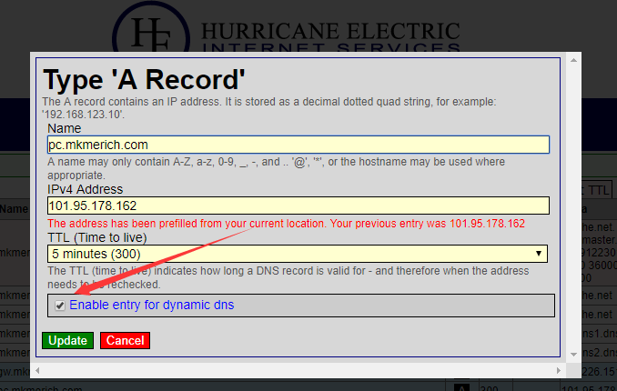
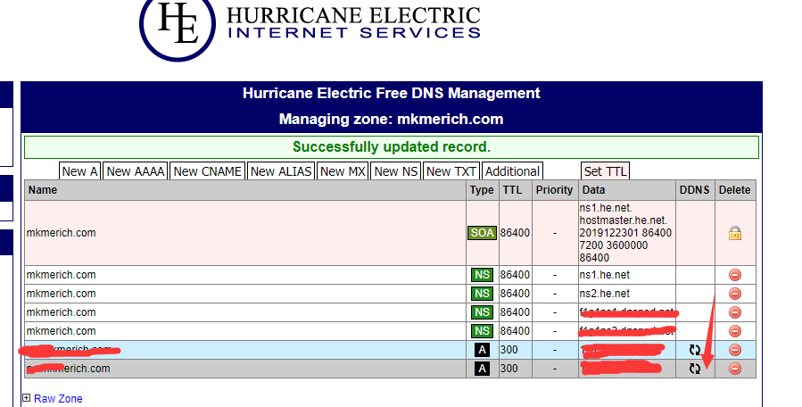

tags: DDNS
    dns.he.net
    动态dns配置


[TOC]


## 使用场景


## 配置

### DDNS服务商选择

我只能说有很多，我认为dns.he.net比较朴素好用，功能很全。

### 添加A记录



- IPv4 Address : 这个他会自动给你填个你的公网出口ip,先不用管
- TTL  ： 由于是动态dns, ip随时会变，所以我都设置为5分钟
- 最后打上勾【使能动态ddns】


### 添加动态更新IP脚本

具体文档可以参考[这里](https://dns.he.net/docs.html)

它提供的API很简单，一共2种形式：

1） 自动识别并更新ip，通过识别你的源ip

```bash
curl -4 "https://<your-sub-domain>:<api-key>@dyn.dns.he.net/nic/update?hostname=<your-sub-domain>"
```

2) 强制指定机器的ip, 如果你想局域网里用域名也成为现实

```bash
curl -4 "https://<your-sub-domain>:<api-key>@dyn.dns.he.net/nic/update?hostname=<your-sub-domain>&myip=192.168.2.3"
```


api-key哪里来的，看下图：




## 参考脚本

```bash
#!/bin/bash
ips=`/sbin/ifconfig -a | grep inet | grep -v 127.0.0.1 | grep -v inet6 | awk '{print $2}' | tr -d "addrs"` 
ip_array=($ips) #转为数组，ip可能有好几个
ip_1=${ip_array[0]} #选第一个ip, 如果要指定的就修改脚本吧
curl -4 "https://pc.mkmerich.com:<my-ip-key>@dyn.dns.he.net/nic/update?hostname=pc.mkmerich.com&myip=${ip_1}"


```

然后呢，做一个Linux定时任务，我懒省事就用crontab了

```bash
*/5 *    * * *   linux-user    /path/to/my/shell-script/update-ip.sh
```


最后我在自己内网中就可以用  `ssh my-user@pc.mkmerich.com`来登录我的linux了，每次重启也不用担心不知道自己电脑ip是多少。


