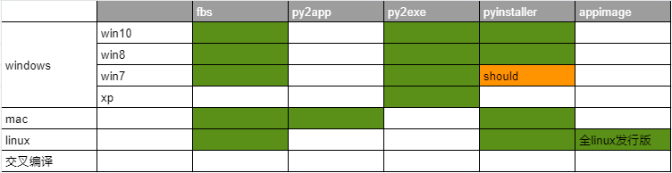
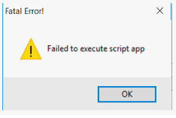

[TOC]

## pyinstaller, py2app, py2exe, fbs功能对比




## py2exe

软件更新已经不活跃，因此也就略过。

## pyinstaller打包pyqt5程序

明确支持win8、win10、理论上支持win7,，支持apple Macos, linux。
pyinsaller可以打包成文件夹形式内含exe入口执行文件的形式，也可以是一个单独的exe文件。

> 截止目前pyinstaller支持的py最高版本为3.7,在3.8上不稳定。

### 打包过程
1. 打包最好使用virtualenv,不要用全局python解释器，这样会打进来很多无关的依赖。
1. 然后在venv里安使用pip装pyinstaller, 很简单 。执行`pip install pyinstaller`
1. 执行打包命令：`pyinstaller  -w  your-main.py`。`-w`的意思是一个带有GUI的程序，不要出现console那个黑乎乎的命令界面。

### FAQ
1. failed to execute script ” When App Clicked。。<br>
出现这个问题情况多样，最大可能是比如你的logging.ini,或者依赖的一些数据、配置、图片等资源在打包的时候没有打进去，因为这些非py的资源是需要人为指定的，pyinstaller不会自动copy。<br>
要找到错误在运行打包命令的时候加入 `--debug imports` 然后去掉`-w`参数,这样重新打包，可以看到命令窗口的输入，里面东西很多，往上翻一番总能看到错误，然后根据缺少的文件在spec文件里的`datas`字段里进行人工指定。`spec`是什么下面简单记录下。
2. spec文件。<br>主要记录下里面的datas这个字段，其他的暂时没用上。当你执行了打包命令`pyinstaller -w --debug import mymain.py`的时候，会自动在当前目录生成一个默认的mymain.spec，里面控制了打包的详细细节。<br>pyinstaller不会自动copy程序依赖的配置文件，数据文件，第三方的exe工具等，这是经常导致打包出来的程序无法运行的主要原因。这些文件在spec文件的datas里进行配置：<br>
```python
a = Analysis(['main.py'],
             pathex=['D:\\workspace\\myproj'],
             binaries=[],
             datas=[('logging.ini','.'),('config.ini','config/')],
             hiddenimports=[],
             hookspath=[],
             runtime_hooks=[],
             excludes=['logs/*.*'],
             win_no_prefer_redirects=False,
             win_private_assemblies=False,
             cipher=block_cipher,
             noarchive=False)
```
datas字段是个tuple数组。每个tuple元素第一个是要copy的数据文件位置（相对于工程根目录), 第二个参数是要copy的打包程序的目的地址，例子中的点代表就在被打成的包的最顶层。如果要放入其他目录比如images参考例子中第二项,这样打成的包里就会有个目录config,下面有config.ini。


## py2app
 py2app主要是完成macos下的python程序打包。

 ### 主要步骤

 1. 工程根目录生成setup.py。 执行命令`py2applet --make-setup gui.py`。py2applet是安装了py2app后自带的。
 2. 和pyinstaller一样，数据文件需要自己手工来指定。<br>
 ```python
 DATA_FILES = ['logging.ini',('appres', ['resource/xx.exe'])] 
 ```
py2app的资源指定写法和pyinstaller有点不一样。他也是一个数组，只不过可以是一个单一文件，也可以是个tuple。单一文件就直接copy到打包的根目录下。如果是个tuple，tuple的第二个元素是一个数组，上例子代表把工程里`resource/xx.exe`copy到打包目标根目录下的appres下面——也就是把xx.exe放到了打成的包的appres/xx.exe。这一点比较坑人。

