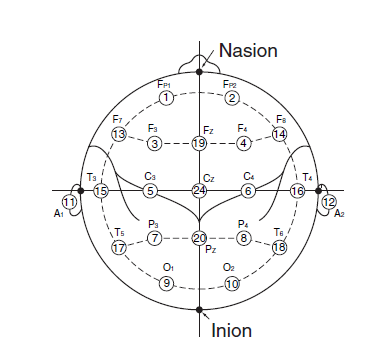
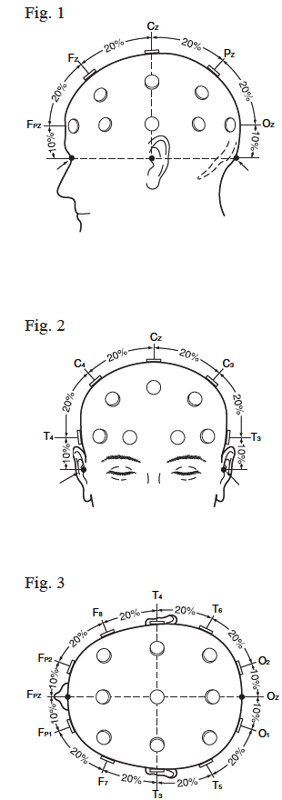
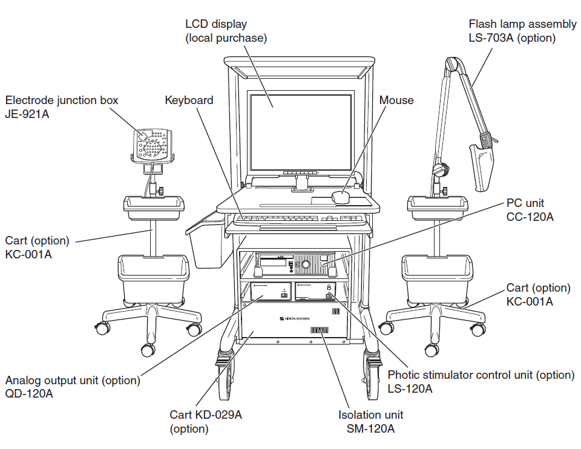
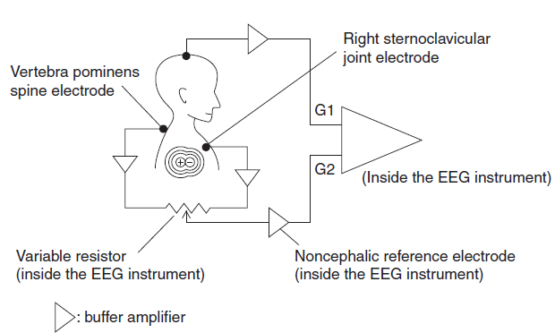

[TOC]

## 国际10-20系统

10-20系统包含19个记录点击和2个参考电极A1, A2。

## Derivation

derivation代表为了表达一个通道，用于组织电极的方式。一共有3种derivation：

### Monopolar derivation

又叫做`Referential Derivation`。

这种derivation使用耳朵A1和A2作为参考电极。也分成几种参考方式。

- normal monopolar derivation。左耳用于左半球参考，右耳用作右半球参考。
- A1+A2。 shorting both ears(in the electrode junction box)
- A1→A2  or A1←A2。只使用一只耳朵。
- A1<->A2。左耳作为右半球参考，右耳作为左半球参考。
- Vx (vertex reference derivation)。也就是以头顶处Cz为参考点。
- AV（Average reference derivation)除去几个特殊输入例如（X*），BN+， BN-，其余的全部头皮电极使用resistors(电阻)形成一个平均点。**额外的特殊输入根据electrode junction box具体情况不同，实际操作中应该把心电，肌电等去除**

参考3.16

### BN Derivation

全名`Balanced Noncephalic Reference`，平衡式非头部参考电极。

### Bipolar Derivation

A1 → A2: Switches all A1 to A2.
A1 ← A2: Switches all A2 to A1.
A1 ↔ A2: Switches A1 and A2.
A1 + A2: Short-circuits A1 and A2 to each other in the electrode junction box.
Vx: Switches all A1 and A2 to CZ.
AV: Switches all A1 and A2 to the reference for AV derivation.
BN: Switches all A1 and A2 to the reference for BN derivation. (Available when the JE-208A or 210A is used.)
SD : Switches all A1 and A2 to the reference for Laplacian derivation.
Aav: Switches all A1 and A2 to the averaged reference of A1 and A2.
Org: Switches all A1 and A2 to the averaged voltage of C3 and C4 for the original reference derivation (system reference).
OFF: Cancels the selection of reference electrode and returns to the programmed setting.