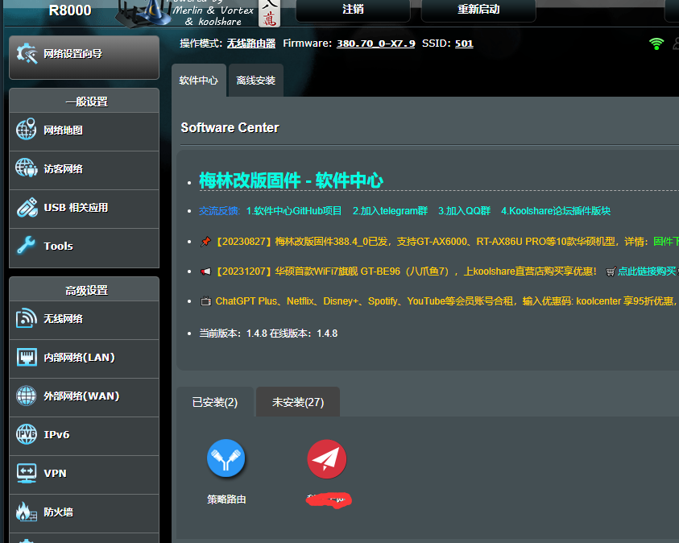

# R8000路由器梅林小记

## 问题
我想用几个号之间互相看视频得奖励。首先要做好安全问题，就要做到：

1. 20个手机都要上网
2. 手机与手机之间不能网络互通
3. 每个手机都有一个独立的公网ip
4. 成本足够低，复用一条家庭带宽

## 解决办法
### 20个手机一起上网

这个比较好办，土豪用流量卡，屌丝用OTG三合一线。
不知道OTG三合一是啥的看这里 https://detail.1688.com/offer/672826327296.html
或者 https://item.taobao.com/item.htm?spm=a21n57.1.0.0.293b523c45hWyf&id=668795725656&ns=1&abbucket=1#detail

USB供电有专门的多口USB供电，但是要注意一定要usb扩展而不是仅仅充电的,USB扩展可以通过USB控制传输数据，如果你只需要通过网络控制那可以忽略。
USB扩展配件可以参考这个：https://detail.tmall.com/item.htm?ali_refid=a3_420434_1006:1106460419:N:+5e3tIOIUlznRm9uzqVoNg==:f146ad95fc30402c3e0afd7717cfea6a&ali_trackid=1_f146ad95fc30402c3e0afd7717cfea6a&id=540858197451&spm=a21n57.1.0.0&sku_properties=148242406:21516

### 手机之间网络不互通

这个需要用到软路由了。当手机连到同一个路由器，那么我需要在路由器的iptable上设置好手机用的网段的几个IP不能互访即可。
> 路由器口不够可以下挂一个多口交换机。

## 每个手机一个独立IP

有好几个办法：

1. ｉｐｖ６
2. 在软路由上使用ｖ２ｒａｙ按照固定ｉｐ分流到不同的socks5或者任何其他例如shadowsocks
3. 手机卡流量，路由器只组局域网进行控制用

## 成本问题
这个问题我是采用了服用家里的100M的电信宽带。细节忽略。


### 上面讲述的方案的拓扑图
以上是理论上的，根据这个理论上的东西会玩的可以做很多改动。当然我自己会玩，我可以把我的方案放下面，成本绝对最低。硬件投入最少。


## 我的方案
下图含3种方案，用到的硬件依次减少，但是对软件和网络理论的掌握要求越来越高。


首先要说的是我的群控是一个机箱，所以插一根网线就能够所有手机上网了。

如果是个人没有这种专用机箱的情况下，可以用多口交换机扩展路由器的网口。


方案1中由于我家电信给的路由器R1接口太少，PC接上之后R2就没法接上，因此中间加入了一个交换机S，用于扩展路由器R1的接口，其他倒没有特别的用途。

方案2中就是把方案1的交换机去掉了，仅此而已，少了一些硬件和线材盘根错节。

方案3则更做了进一步精简，群控主机使用网线连到主机上，主机另外一个网口插到路由器上。此时我的pc上运行了一个虚拟机Linux，把这台Linux做成一个网关，让群控主机通过这个网关出去。

- dhcp在Linux上打开
- socks5+v2ray+redsocks 透明代理
- 网关
- 手机静态IP
- vm上隔离这个网段下的IP，禁止互通，这样可以减少风控的风险。


## 梅林配置记录
### 作为主路由的扩展（AP模式或者叫无线访问点模式）


这个模式需要把路由的WAN口连接到上一级路由器WAN口。其他不做设置即可。
这种模式下，连接到二级路由器上的设备得到的ip和直接连在一级路由器上的设备获得的ip是一个网段的。一级和二级路由上都能看到全部联网的设备。

### 作为独立子网（上图中的无线路由器模式）

这种模式的特点是，连接到二级路由上的设备有完全独立的一个子网，和一级路由的设备不能互通。一级路由器只能看到二级路由IP，但是无法看到二级路由上连接的设备。

在这种模式下，需要比AP模式做更多的配置。

- 二级路由WAN连到上级路由任何一个LAN口
- 二级路由的WAN口设置为静态IP，并且网关设置为一级路由地址（作为网关）
- 二级LAN口打开DHCP，设置一个和一级路由不同的网段


## 梅林的商店安装离线插件
梅林有很多人在魔改，我用的是https://www.koolcenter.com/ 这个站点魔改的，国内比较火，应该不会有问题。

### 路由器r8000固件下载地址
我的路由器是网件R8000，路由器固件不怎么更新了，毕竟几年前的机器，固件下载地如下：
https://fw.koolcenter.com/well-known-authors/KoolCenter_Merlin_Legacy_380/Netgear/

上面连接还有其他一些型号的都可以找到。

### 刷回网件原始固件
如果要刷回原固件可以在这里找到原始的网件R8000固件：https://fw.koolcenter.com/well-known-authors/KoolCenter_Merlin_Legacy_380/Netgear/R8000/Merlin%20to%20OFW/


### 安装插件之前配置
`第一步`
安装之前先打开一些配置项：


`第二步`
其次登录到ssh中修改一下配置，这样可以安装一些你懂的一些插件。配置看这里，很简短：https://zhuanlan.zhihu.com/p/402240863

核心就是ssh进路由器，执行这么一句
```sh
sed -i 's/\tdetect_package/\t# detect_package/g' /koolshare/scripts/ks_tar_install.sh

```
 `最后`
 来到 https://hq450.github.io/fancyss/ 下载对应的插件，我的R8000经过一番查找最后在 https://github.com/hq450/fancyss_history_package/blob/master/legacy/fancyss_arm380/shadowsocks_4.2.2.tar.gz 下载到了。

 然后进入软件中心上传，安装。





## 工具
- ip检测API https://ip.sb/api/
- ipv6另一个api https://limit.888005.xyz/


