# K 线转折点检测算法对比：从 BEAST 到 psimpl 八种折线简化

> 生成时间：2026-04-27
> 测试数据：上证指数 30 分钟 K 线（`sh000001` 1m 聚合）
> 测试窗口：3 段代表性行情（2 周左右）
> 源代码：
> - [`celue/psimpl_all_algos.py`](https://github.com/drunkpig/tdx-signal-viewer/blob/main/celue/psimpl_all_algos.py) — 9 个折线简化算法实现 + 对比图生成
> - [`celue/polysimplify.py`](https://github.com/drunkpig/tdx-signal-viewer/blob/main/celue/polysimplify.py) — Visvalingam-Whyatt 实现（来自 Permafacture/Py-Visvalingam-Whyatt，MIT）
> - [`celue/beast_turning.py`](https://github.com/drunkpig/tdx-signal-viewer/blob/main/celue/beast_turning.py) — BEAST 季度变点检测
> - [`celue/psimpl_turning.py`](https://github.com/drunkpig/tdx-signal-viewer/blob/main/celue/psimpl_turning.py) — 最早的 PD / RW 单算法实验
> - [`celue/psimpl_tol_compare.py`](https://github.com/drunkpig/tdx-signal-viewer/blob/main/celue/psimpl_tol_compare.py) — RW 不同 tol 值的粒度对比
> - [`celue/zigzag_chan_compare.py`](https://github.com/drunkpig/tdx-signal-viewer/blob/main/celue/zigzag_chan_compare.py) — ZigZag + 缠论笔（番外篇）
> - [`celue/rw_corridor_plot.py`](https://github.com/drunkpig/tdx-signal-viewer/blob/main/celue/rw_corridor_plot.py) — RW 单算法 + 走廊可视化
> - [`celue/rw_advanced_plot.py`](https://github.com/drunkpig/tdx-signal-viewer/blob/main/celue/rw_advanced_plot.py) — RW 自适应 tol + 跨周期联动（带走廊开关）

---

## 背景：为什么要检测 K 线转折点？

在个股 Signal 1 策略回测中发现：**当大盘同向时胜率明显高，反向时亏损居多**。要把"大盘跟随"做成过滤器，需要一个算法能实时告诉我：

- 当前大盘处于什么趋势段
- 刚刚有没有发生"方向翻转"

这就是典型的**时序分段 / 转折点检测（Changepoint Detection）** 问题。要求：

1. **在线算法** — 只能用当前和过去的 bar，不能用未来数据
2. **转折点稳定** — 今天确认的转折点，明天不要又被改写
3. **延迟可控** — 转折确认最多晚 1~2 根 bar
4. **参数少、易调** — 一个阈值就能换档

下文对比 8 个来自经典折线简化库 [psimpl](https://psimpl.sourceforge.net/) 的算法，以及作为对照组的 BEAST 贝叶斯变点检测。

---

## 算法全景

### 完整清单

| # | 算法 | 一句话思路 | 在线? | 本文实现 |
|---|---|---|---|---|
| 1 | **Nth Point**       | 每隔 N 个点保留一个（最朴素） | ✅ | ✅ |
| 2 | **Radial Distance** | 距上一保留点 < r 的都删掉       | ✅ | ✅ |
| 3 | **Perpendicular Distance (PD)** | b 到 ac 线段垂距 < tol 删掉，迭代直到稳定 | ⚠️ 迭代 | ✅ |
| 4 | **Reumann-Witkam (RW)** | 锚点→下一点方向建走廊，冲出时前一点成新锚点 | ✅ | ✅ |
| 5 | **Opheim**          | RW 变体：走廊 + 径向距离双约束 | ✅ | ✅ |
| 6 | **Lang**            | 滑动窗口 [i, i+k]，检查窗内所有点到弦的垂距 | ✅ 有 k 窗延迟 | ✅ |
| 7 | **Douglas-Peucker (DP)** | 递归分治：找整段最大偏离点分裂 | ❌ 离线 | ✅ |
| 8 | **Douglas-Peucker-N** | DP 变体，限制最多保留 N 个点 | ❌ 离线 | ✅ |
| 9 | **Visvalingam-Whyatt (VW)** | 按**三角形面积**排序，面积小的点删掉 | ❌ 离线 | ✅ |
| 10 | **BEAST**          | 贝叶斯 MCMC 变点模型 | ❌ 离线 | ✅（对照） |
| 11 | **ZigZag**         | 相对极值 + 回撤百分比阈值触发翻转 | ✅ | ✅（番外） |
| 12 | **缠论笔**         | 包含关系处理 + 3-bar 分型 + 笔有效性 | ✅ | ✅（番外） |

> ⚠️ 11/12 不属于 psimpl 折线简化家族，但在技术分析圈广泛使用，作为番外一并对比。

### 在线 / 离线 对比

| 算法 | 在线 | 转折点稳定 | 确认延迟 | 参数难度 | 适合实盘 |
|---|---|---|---|---|---|
| BEAST            | ❌ | — | — | 中 | ❌（依赖未来） |
| Nth Point        | ✅ | ✅ 固定间隔 | 0 | 无（只有 N） | ⚠️ 太死板 |
| Radial Distance  | ✅ | ✅ 永不改写 | 0 | 简单 | ⚠️ 仅作滤波 |
| Perpendicular D. | ⚠️ | ❌ 每轮会重排 | 不稳定 | 难 | ❌ |
| Reumann-Witkam   | ✅ | ✅ 永不改写 | 1 bar | 简单（只有 tol） | ✅ |
| Opheim           | ✅ | ✅ 永不改写 | 1 bar | 中（dmin+dmax） | ✅ |
| Lang             | ✅ | ✅ 永不改写 | k bar | 中（tol+窗口 k） | ✅ |
| Douglas-Peucker  | ❌ | — | — | 简单 | ❌（需整段） |
| DP-N             | ❌ | — | — | 简单（点数） | ❌（需整段） |
| Visvalingam-Whyatt | ❌ | — | — | 简单（面积或点数） | ❌（需整段） |
| ZigZag           | ✅ | ✅ 永不改写 | 回撤≥δ 才触发 | 简单（只有一个 %） | ✅ |
| 缠论笔           | ✅ | ✅ 笔一旦确认稳定 | 1~数根 bar | 中（包含规则+最小间隔） | ✅ |

---

## 同窗口 9 算法大对比图

同一段 K 线，9 种算法分割结果上下叠放，直观看到各自粒度差异：


---

## 逐算法详解

> 下面 9 个算法统一使用 **2024-09-18 ~ 2024-10-11** 这段"9 月底大涨"行情作为样例（30m × 104 根 bar），方便横向对比。
> 优缺点重点评估两件事：**是否需要未来数据**、**新 bar 到来时转折点会不会被改写**——这两点直接决定能否用作实盘信号。

### 1. Nth Point（定步长抽样）

**思路**：从第 0 根 bar 开始每隔 N 根保留一个，首末点必保留。最原始的降采样，等价于均匀下采样。

- **参数**：步长 N（本文 N=8，对应 ~1 交易日）


**用于选股场景的评估**：

| 维度 | 结论 |
|---|---|
| 需要未来数据？ | ❌ 不需要，严格在线 |
| 新 bar 会改写历史转折？ | ❌ 不会，已保留的点永不变动 |
| 确认延迟 | 0 bar |
| **能做大盘跟随信号吗？** | **不能** |

**原因**：这个算法**完全忽略价格**——不管是一天暴涨 3% 还是窄幅盘整，都统一每 8 根取一个。对策略毫无信息量，只能作为降采样 baseline 用来对照其他算法。

---

### 2. Radial Distance（径向距离）

**思路**：保留首点；遍历后续点，只要与"上一个保留点"的**径向（欧氏）距离** ≥ r，就保留。

```
dist = sqrt((i - last_x)^2 + (prices[i] - last_y)^2)
```

- **参数**：半径 r（本文 r=15 指数点）


**用于选股场景的评估**：

| 维度 | 结论 |
|---|---|
| 需要未来数据？ | ❌ 不需要，严格在线 |
| 新 bar 会改写历史转折？ | ❌ 不会，单向扫描 |
| 确认延迟 | 0 bar |
| **能做大盘跟随信号吗？** | **不能直接做，但可作预处理** |

**原因**：只看"点与点距离"不看"形状"——缓慢上涨 100 点 vs 暴跌 100 点输出相似的点数分布，无法区分趋势方向。可以作为 RW / Lang 之前的第一道降噪（先过滤掉微小抖动），但单独无法触发交易信号。

---

### 3. Perpendicular Distance（垂直距离，迭代）

**思路**：对每 3 个相邻保留点 (a, b, c)，算 b 到线段 ac 的垂直距离；若 < tol 则删除 b。**反复扫描直到没有点被删**。

- **参数**：垂距阈值 tol（本文 tol=10）


**用于选股场景的评估**：

| 维度 | 结论 |
|---|---|
| 需要未来数据？ | ⚠️ 严格说不需要，但行为不稳定 |
| 新 bar 会改写历史转折？ | ✅ **会！**这是致命缺陷 |
| 确认延迟 | 不确定 |
| **能做大盘跟随信号吗？** | **不能** |

**原因**：每次来新 bar 都要重新迭代到"稳定态"，而新 bar 可能改变中间某个三元组的垂距判定，导致**前几天已经识别的转折点在今天被撤销**。实盘中这等于"昨天说转折要开仓，今天又说没转折撤单"——信号反复，无法执行。理论在线但实际不可用。

---

### 4. Reumann-Witkam（走廊算法）⭐

**思路**：

1. 从锚点 A 出发，用 A→A+1 方向作为走廊的中轴，走廊宽度为 2·tol
2. 逐个检查 A+2, A+3, ... 是否在走廊内（点到中轴的垂距 ≤ tol）
3. 某点 J **冲出走廊** → J-1 成为新转折点和新锚点
4. 从 J-1 重新建走廊，继续向前

```
           走廊上界 ─────
                       ╲
  ●──●──●──●──●──●──●───●  ← 冲出走廊
   A    ↑
        J-1 (新锚点)
           走廊下界 ─────
```

- **参数**：走廊半宽 tol（本文 tol=10）


**走廊可视化**（便于直观理解 tol 的作用）——每段锚点→锚点+1 的方向延伸出橙色中轴（点线），蓝色虚线是 ±tol 走廊边界，冲出蓝线就是新锚点：

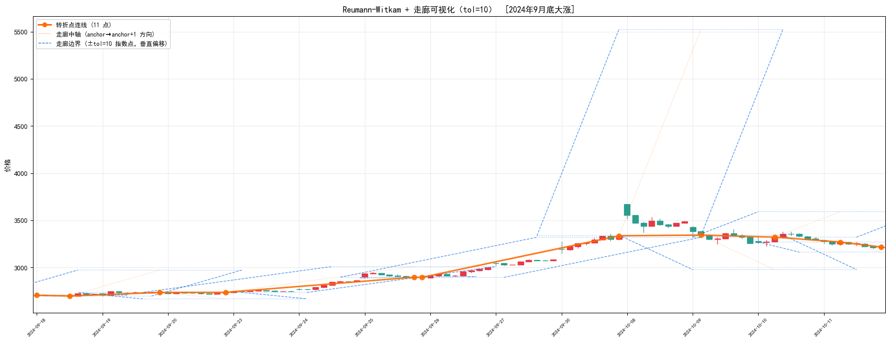

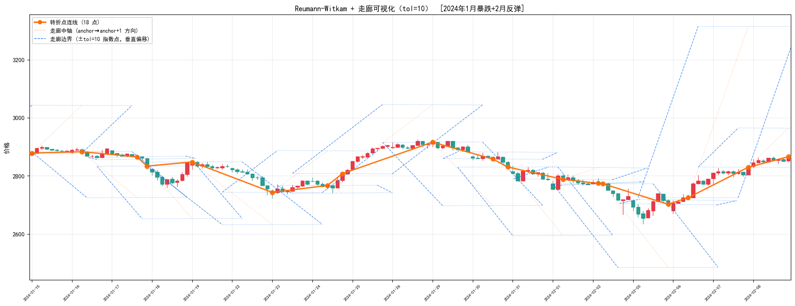

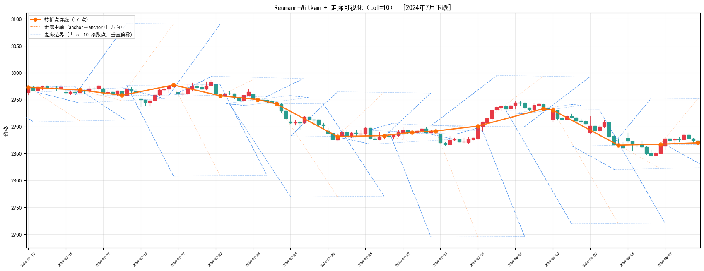

**用于选股场景的评估**：

| 维度 | 结论 |
|---|---|
| 需要未来数据？ | ❌ 不需要，严格前向 O(n) |
| 新 bar 会改写历史转折？ | ❌ **绝对不会** |
| 确认延迟 | 1 bar（冲出走廊的那根 bar 触发前一根确认） |
| **能做大盘跟随信号吗？** | **✅ 可以，本文首选** |

**原因**：算法数学上保证"锚点前移后永不回溯"——一旦某个 bar 被标记为转折点，无论后面来多少新数据都不会撤销。唯一的不确定性在"当前走廊"里最新那段，但这对交易而言也合理：新趋势段要等到它真正形成（下一根 bar 冲出走廊）才能确认。30 分钟的确认延迟对日内跟随策略完全可接受。

---

#### 4.1 进阶改进一：tol 自适应（按百分比）

`tol=10` 这个硬编码数字只适合上证指数 3000 点附近。换成个股 50 元、或者指数涨到 5000 点、或者转场到美股 S&P 500，都要手工调。**自适应方案**：把 `tol` 直接绑定到 close 的百分比——例如 `tol[i] = close[i] × 0.3%`。大盘涨到 3300 时走廊约 ±9.9，跌到 2700 时 ±8.1，自动随量级缩放。

**统一接口**（`celue/psimpl_all_algos.py:reumann_witkam`）：

```python
def reumann_witkam(prices, tol=None, *, pct=None):
    """
    tol 和 pct 两种方式指定走廊半宽，tol 优先。
      - tol: 标量或 array[n]（指数点）
      - pct: close 的百分比，tol[i] = prices[i] × pct
    """
    ...
```

**三段窗口对比图（固定 tol=10 vs 自适应 0.3%，带严格走廊）**：

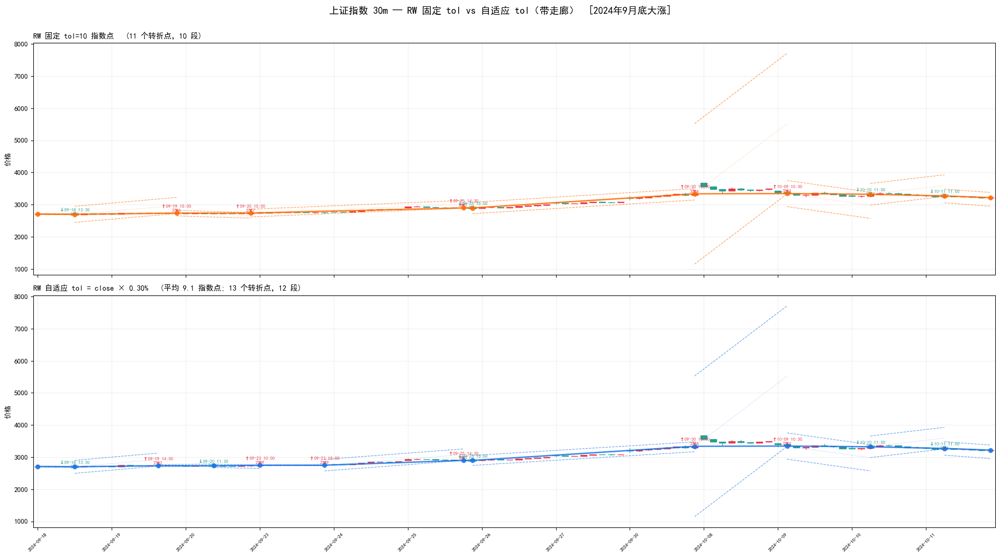

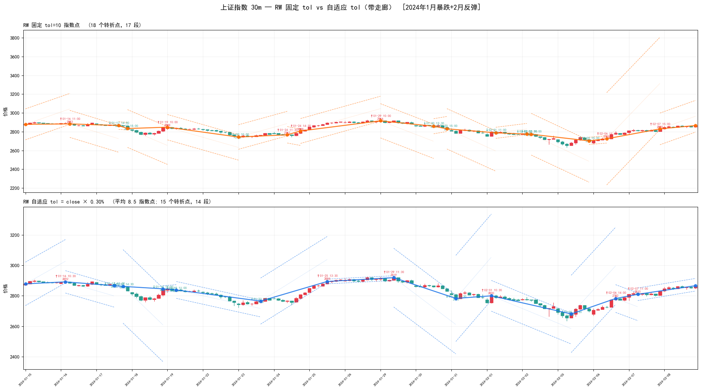

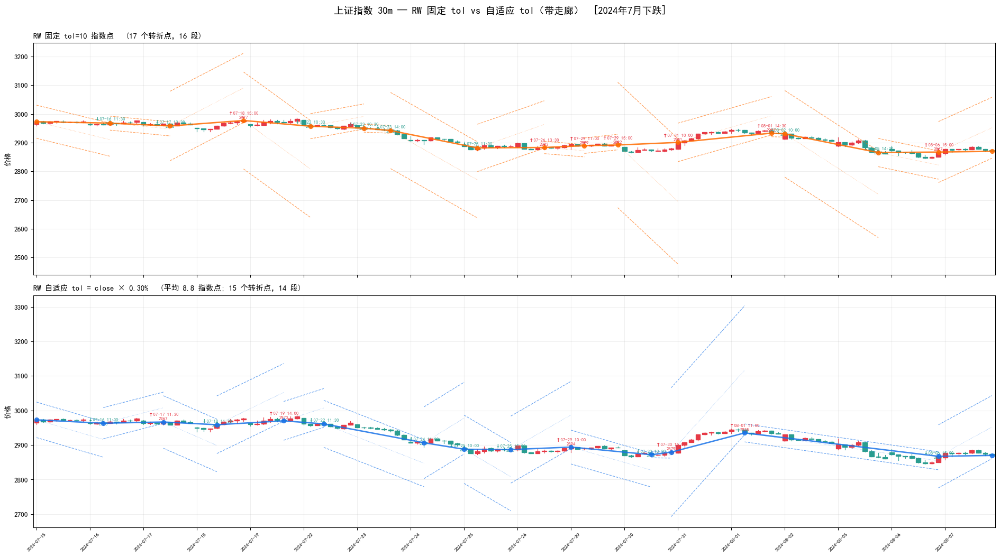

在 2024 年指数 2700~3300 这个量级，两者段数差别很小；真正体现价值要等价格量级变化或跨品种。

**走廊画法（严格版）**：图上虚线不是简单的"价格 ±tol"——RW 算法在 (bar_idx, price) 空间检查垂直距离 ≤ tol，等价于价格方向上 `|prices[j] − y_center(j)| ≤ tol·√(1+dy²)`。所以有斜率的段，虚线到中轴的价格距离 > tol，斜率越大走廊越宽。这样画出来 K 线收盘价冲出虚线的那一刻，就是算法实际标转折点的那一刻。

---

#### 4.2 进阶改进二：跨周期联动（5m / 15m / 30m）

缠论的"级别联立"思想可以直接移植到 RW——同一窗口同时跑 5m、15m、30m 三个级别，用**同一个** `pct=0.3%` 自适应阈值，产出的段密度递减（5m 最密、30m 最稀疏），三个级别方向一致的时刻就是大盘最强单方向信号。

共享 x 轴用"交易分钟索引"（每天 240 分钟紧凑编号，跳过夜里/周末/午休），三个子图在时间上精确对齐。

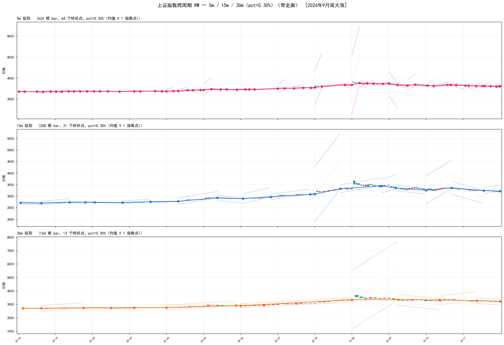

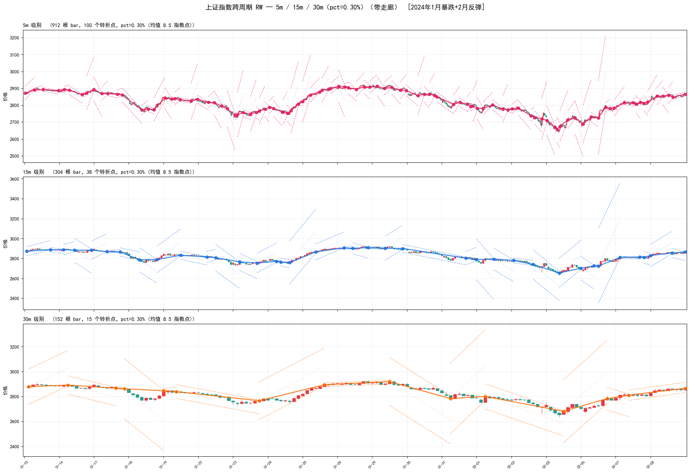

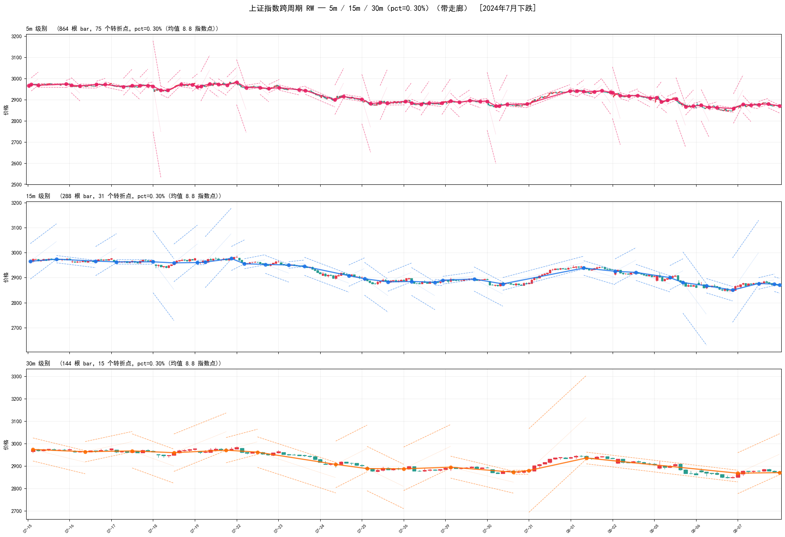

**用法**：

- **强信号**：5m/15m/30m 三个级别方向一致 → 最高确定性，适合主趋势跟随
- **背离**：5m 向下但 30m 还向上 → 小级别回调，大级别未破 → 通常是短线买入/加仓机会
- **转折先兆**：30m 快要冲出走廊但 5m 已经反向数段 → 大级别即将确认转向

源代码：[`celue/rw_advanced_plot.py`](https://github.com/drunkpig/tdx-signal-viewer/blob/main/celue/rw_advanced_plot.py) —— 两个 plot 函数都支持 `(tol=None, pct=None, show_corridor=False)` 参数，tol 优先。

---

### 5. Opheim

**思路**：RW 的增强版。在走廊约束之外，再加"距锚点的**径向距离**不得超过 dmax"的硬约束；任一触发即切断。

- **参数**：走廊半宽 `dmin`、最大径向 `dmax`（本文 10 / 30）


**用于选股场景的评估**：

| 维度 | 结论 |
|---|---|
| 需要未来数据？ | ❌ 不需要，继承 RW 在线特性 |
| 新 bar 会改写历史转折？ | ❌ 不会 |
| 确认延迟 | 1 bar |
| **能做大盘跟随信号吗？** | **✅ 可以，RW 的替代方案** |

**原因**：RW 在一段非常平缓的长趋势中可能把整段"吞掉"只给一个转折点，错过中间的小级别调整。Opheim 的 dmax 约束强制"每走过 dmax 距离就重新评估一次方向"，在震荡行情里比 RW 给出更细的分段，适合交易频率更高的场景。代价是多一个参数要调。

---

### 6. Lang

**思路**：维护一个**前瞻窗口 [i, i+k]**：

1. 计算窗内所有中间点到弦 i–(i+k) 的**最大垂直距离**
2. 若 max_d < tol → 删除窗内所有中间点，i 直接跳到 i+k
3. 否则 k-- 缩小窗口重试

- **参数**：垂距阈值 tol、窗口 k（本文 10 / 5）


**用于选股场景的评估**：

| 维度 | 结论 |
|---|---|
| 需要未来数据？ | ⚠️ 需要窗口内 k 根 bar（本文 k=5） |
| 新 bar 会改写历史转折？ | ❌ 不会 |
| 确认延迟 | **k bar**（30m × 5 = 2.5 小时） |
| **能做大盘跟随信号吗？** | **⚠️ 勉强可以，但延迟偏大** |

**原因**：Lang 判断更稳健（看窗内最大偏离，不是首个冲出），抗噪性比 RW 好。但它需要等窗口内所有 k 根 bar 都到齐才能判断前一段是否结束——对 30m 周期就是 2.5 小时延迟，对交易时机敏感的场景偏慢。适合做**事后段落总结**（比如每天收盘后给当天的几段趋势贴标签），不适合做**实时开仓信号**。

---

### 7. Douglas-Peucker（经典，递归分治）

**思路**：

1. 连接首末两点为一条弦
2. 找段上**偏离弦最远**的点 P
3. 若 P 到弦的距离 > tol：保留 P，以 P 为分界递归处理 [起点, P] 和 [P, 末点]
4. 否则：段内所有中间点全删

- **参数**：垂距阈值 tol（本文 tol=10）


**用于选股场景的评估**：

| 维度 | 结论 |
|---|---|
| 需要未来数据？ | ✅ **是，完全需要未来数据** |
| 新 bar 会改写历史转折？ | ✅ **每来一根新 bar 都可能全盘改写** |
| 确认延迟 | 不适用 |
| **能做大盘跟随信号吗？** | **不能** |

**原因**：DP 从"整段的首末两点"开始切分，需要知道整段的结束位置。实盘中你永远不知道"整段"在哪结束——每来 1 根 bar 都会改变终点，从而改变最大偏离点的位置，导致之前所有转折点重新排布。这也是文献里 DP 被归类为"offline simplification"的根本原因。**只能用于事后复盘、给历史 K 线打段落标签**，不能产生交易信号。

---

### 8. Douglas-Peucker-N（限点数）

**思路**：DP 的变体。使用优先队列（最大堆）逐步执行分裂：

1. 初始：首末两点入列
2. 从堆里弹出"当前最大偏离段"，在偏离最大处分裂，保留分裂点
3. 重复直到保留点数达到 N

- **参数**：目标点数 N（本文 N=12）


**用于选股场景的评估**：

| 维度 | 结论 |
|---|---|
| 需要未来数据？ | ✅ **是** |
| 新 bar 会改写历史转折？ | ✅ **会** |
| 确认延迟 | 不适用 |
| **能做大盘跟随信号吗？** | **不能** |

**原因**：和经典 DP 一样需要整段数据。但它适合**固定输出维度**的特征工程场景——比如要给每段 2 周的大盘行情生成一个 12 维的"关键转折点特征"喂给机器学习模型。这是回测 / 训练场景，不是实盘信号。

---

### 9. Visvalingam-Whyatt（面积权重）

**思路**：前面的 RW / Opheim / Lang / DP 都用"**距离**"作为点的重要性度量，VW 换了一个维度——用"**三角形面积**"。

1. 对每个中间点 `P[i]`，计算三角形 `(P[i-1], P[i], P[i+1])` 的**面积**（叫 effective area，有效面积）
2. 找面积最小的点，把它删掉（面积小 = 这个点几乎在直线上 = 不重要）
3. 删掉后，重算它**左右两个邻居**的有效面积（邻居的相邻点变了）
4. 反复直到最小面积 > 阈值，或剩余点数达到 N

这个算法有个漂亮的副产物：每个点都得到一个"effective area"分数，相当于**重要性排名**。可以一次计算后，在不同阈值下切换分辨率——低阈值看细节，高阈值看大局。GIS / 地图软件里被广泛使用（按 zoom level 切换折线粒度）。

- **库**：[Permafacture/Py-Visvalingam-Whyatt](https://github.com/Permafacture/Py-Visvalingam-Whyatt)（纯 Python，MIT）
- **参数**：面积阈值（本文 area_tol=30，单位 = bar × 指数点）


**用于选股场景的评估**：

| 维度 | 结论 |
|---|---|
| 需要未来数据？ | ✅ **是**，计算 P[i] 的面积必须知道 P[i+1] |
| 新 bar 会改写历史转折？ | ✅ 会，末端三角形重算会触发优先级队列重排 |
| 确认延迟 | 不适用（离线） |
| **能做大盘跟随信号吗？** | **不能，但非常适合特征工程** |

**原因**：和 DP 一样，它需要知道整段序列才能排面积。但相比 DP-N，**VW 的重要性排序在"加数据"后更稳定**——因为面积是个局部量（只依赖 3 个相邻点），而 DP 的距离是全局量（依赖整段的首末点）。实际意义：如果你要给过去 2 周大盘生成"12 个最重要转折点"的特征向量，VW 比 DP-N 更合理。

**和 DP / DP-N 的区别**：

| 维度 | Douglas-Peucker | Visvalingam-Whyatt |
|---|---|---|
| 重要性度量 | 垂直距离（到整段弦） | 三角形面积（仅邻近 3 点） |
| 工作方向 | 递归自顶向下分裂 | 迭代自底向上合并 |
| 输出特性 | 单一 tol 阈值 | 每点一个"重要度分数"，支持多分辨率 |

---

### 10. BEAST（贝叶斯变点检测，对照组）

**思路**：用 MCMC 采样估计一个"分段线性 + 变点数量"的贝叶斯模型，输出每个位置的**变点概率**。

```python
import Rbeast as rb
o = rb.beast(Y, season='none', tcp_minmax=[0, 15],
             torder_minmax=[0, 1], mcmc_samples=8000)
cp_prob = o.trend.cpOccPr  # 每个点的变点概率
```

- **库**：[Rbeast](https://github.com/zhaokg/Rbeast)（`pip install Rbeast`）
- **参数**：最大变点数、趋势阶数、MCMC 采样数


> 注：BEAST 由于计算开销大（每季度 30s），这里用 2024Q3 的完整季度图代替同一 2 周窗口，同样能看到它识别的变点位置。

**用于选股场景的评估**：

| 维度 | 结论 |
|---|---|
| 需要未来数据？ | ✅ **是，MCMC 对整段序列采样** |
| 新 bar 会改写历史转折？ | ✅ **会，重跑结果可能不同** |
| 确认延迟 | 不适用 |
| **能做大盘跟随信号吗？** | **不能** |

**原因**：BEAST 输出的是**概率**，比 DP 的布尔值更有信息量，可以用置信度阈值过滤。但它本质还是离线批处理：每次新 bar 来了要从头重跑 8000 次 MCMC 采样，单次运行 ~30 秒。即便接受这个延迟，结果本身也会因为"采样序列变长"而重新分布概率，导致昨天的变点今天可能消失。**适合做研究**（比如统计分析去年所有确认变点的胜率），**不适合实盘**。

---

## 番外：ZigZag 与缠论笔

psimpl 家族是通用**折线简化**算法，用价格作为"折线的 y 值"。但技术分析圈还有两个经常被拿来做转折点检测的方法：**ZigZag** 和**缠论**。它们不做"简化折线"，而是直接定义"什么算转折"——所以思路和 psimpl 那九个不完全对齐，单独列一章。

实现位置：[`celue/zigzag_chan_compare.py`](https://github.com/drunkpig/tdx-signal-viewer/blob/main/celue/zigzag_chan_compare.py)（两个算法都是几十行的纯 Python 内联实现，方便对比阅读；生产级的多周期联立/中枢/走势可以直接用 [waditu/czsc](https://github.com/waditu/czsc) 或 [Vespa314/chan.py](https://github.com/Vespa314/chan.py)）。

### 同窗口对比图

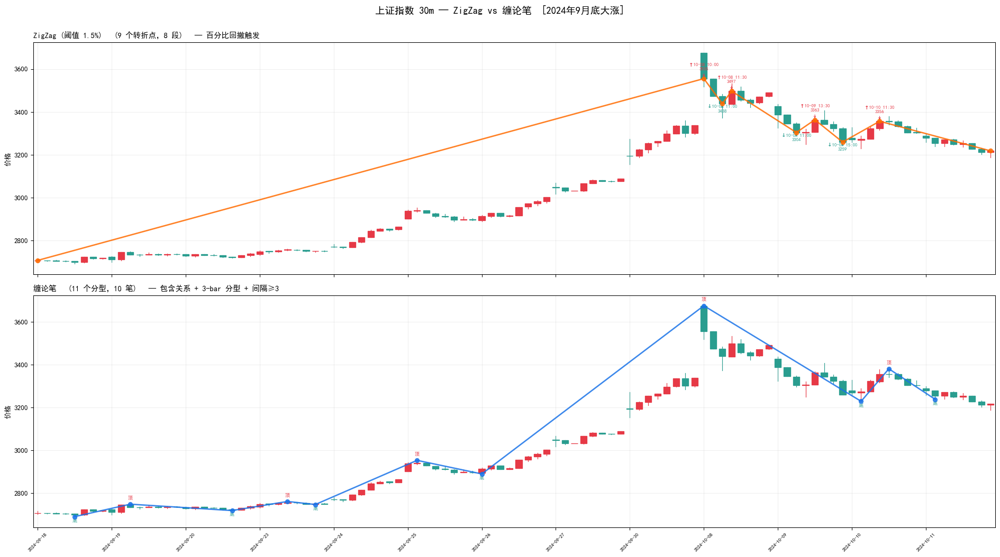

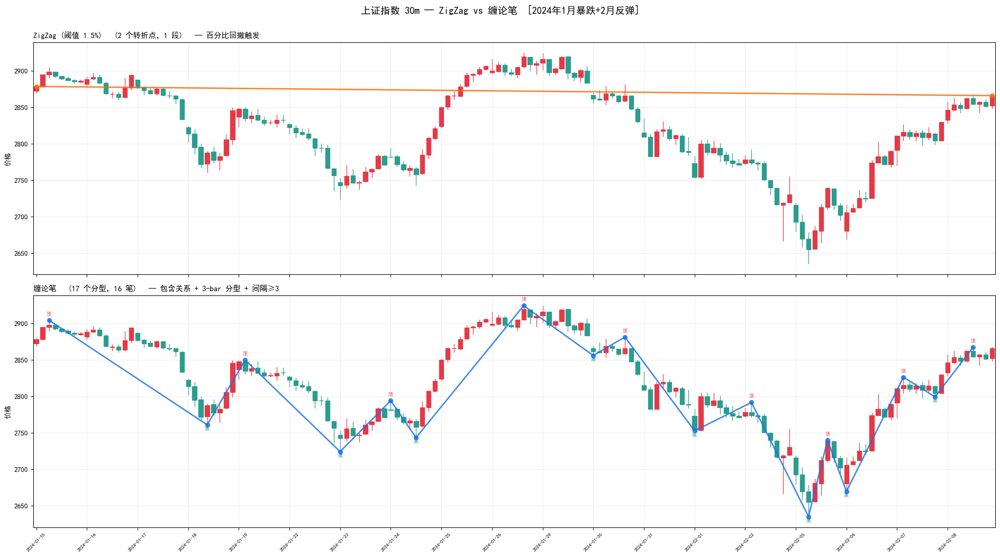

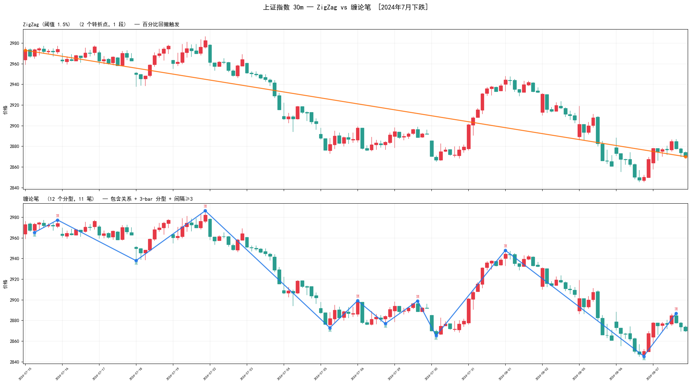

---

### 11. ZigZag（百分比回撤）

**思路**：最老派的摆动点指示器，只有一个百分比阈值 δ。

1. 起始点为锚点，方向未定
2. 新 bar 来：
   - 若方向 up：价格创新高 → 更新锚点；否则若回撤 ≥ δ → 前锚点确认为顶，翻转为 down
   - 若方向 down：对称逻辑
3. 只有翻转那一刻才输出新转折点（并把新极值作为新锚点）

```python
def zigzag_pivots(prices, up_thresh=0.03, down_thresh=-0.03):
    n = len(prices); pivots = [0]
    last_p, last_i, trend = prices[0], 0, 0
    for i in range(1, n):
        p = prices[i]
        if trend >= 0:
            if p > last_p: last_p, last_i = p, i
            elif (p / last_p - 1) <= down_thresh:
                if pivots[-1] != last_i: pivots.append(last_i)
                trend, last_p, last_i = -1, p, i
        if trend <= 0:
            if p < last_p: last_p, last_i = p, i
            elif (p / last_p - 1) >= up_thresh:
                if pivots[-1] != last_i: pivots.append(last_i)
                trend, last_p, last_i = +1, p, i
    if pivots[-1] != n - 1: pivots.append(n - 1)
    return pivots
```

- **参数**：上/下回撤阈值 up_thresh / down_thresh（本文都设为 ±1.5%）

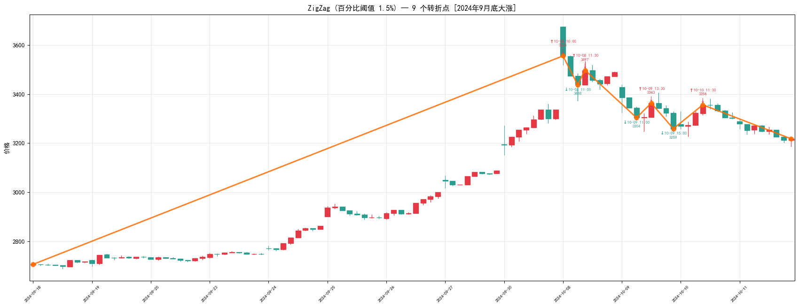

**用于选股场景的评估**：

| 维度 | 结论 |
|---|---|
| 需要未来数据？ | ❌ 不需要，严格在线 O(n) |
| 新 bar 会改写历史转折？ | ❌ **不会**，已确认极值永不回溯 |
| 确认延迟 | 取决于回撤达成时间（不固定，可能几根 bar 也可能十几根） |
| **能做大盘跟随信号吗？** | **✅ 可以** |

**和 RW 的本质区别**：

| 维度 | Reumann-Witkam | ZigZag |
|---|---|---|
| 触发条件 | 点到走廊中轴**垂距** > tol（绝对距离） | 从极值**相对回撤** ≥ δ（百分比） |
| 参数单位 | 指数点 | % |
| 尺度适应 | 股价 5 元和 500 元用同 tol 不合理 | δ 是百分比，跨股自适应 |
| 确认延迟 | 冲出走廊的 1 根 bar | 回撤到 δ 的那根 bar，可能更晚 |

**结论**：ZigZag 本质上是 "RW 的百分比版本"。做 A 股大盘（指数点数量级固定）差别不大；做跨股票、跨资产通用信号时 ZigZag 更省事——阈值直接用 2% 就能统一处理大小盘。缺点是**触发延迟不固定**：一波慢涨可能很久不回撤 δ，确认点就一直悬着。

---

### 12. 缠论笔（分型 + 包含关系 + 笔有效性）

**思路**：缠论不是一个算法，是一套流水线。最小可用的"笔"识别由 3 步组成：

1. **包含关系处理**：若相邻两根 K 线互相完全包含，根据**之前的方向**合并成一根（上行取高高、下行取低低）
2. **分型识别**：处理后的 3 根连续 bar 中，中间那根的 high 最高且 low 最高 → **顶分型**；反之 → **底分型**
3. **笔有效性**：两个分型要构成一笔，必须**类型相反**且**中间至少隔 3 根合并后 bar**（防止分型扎堆导致的假笔）

```python
def chanlun_bi(highs, lows):
    # step1: 包含关系处理（上行取高高、下行取低低）
    merged, direction = [], 0
    for i in range(len(highs)):
        h, l = highs[i], lows[i]
        if not merged: merged.append((i, h, l)); continue
        pi, ph, pl = merged[-1]
        if (ph >= h and pl <= l) or (ph <= h and pl >= l):
            if direction >= 0:
                merged[-1] = (i if h >= ph else pi, max(ph, h), max(pl, l))
            else:
                merged[-1] = (i if l <= pl else pi, min(ph, h), min(pl, l))
        else:
            direction = +1 if (h > ph and l > pl) else (-1 if h < ph and l < pl else direction)
            merged.append((i, h, l))
    # step2: 3-bar 分型
    fxs = []
    for k in range(1, len(merged) - 1):
        pi, ph, pl = merged[k-1]; ci, ch, cl = merged[k]; ni, nh, nl = merged[k+1]
        if ch > ph and ch > nh and cl > pl and cl > nl: fxs.append((k, ci, ch, 'top'))
        elif ch < ph and ch < nh and cl < pl and cl < nl: fxs.append((k, ci, cl, 'bot'))
    # step3: 笔（异类型 + 间隔≥3）
    bi = []
    for fx in fxs:
        if not bi: bi.append(fx); continue
        if bi[-1][3] == fx[3]:
            if (fx[3]=='top' and fx[2]>bi[-1][2]) or (fx[3]=='bot' and fx[2]<bi[-1][2]):
                bi[-1] = fx
        elif fx[0] - bi[-1][0] >= 3:
            bi.append(fx)
    return bi
```

- **参数**：基本无参（严格缠论定义）。若想放松可调分型间隔（3→2）或加价差阈值

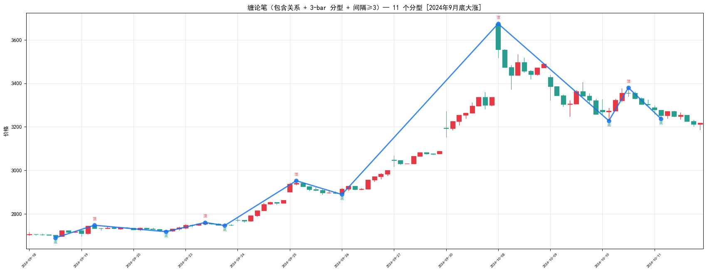

**用于选股场景的评估**：

| 维度 | 结论 |
|---|---|
| 需要未来数据？ | ❌ 分型需要后一根 bar 确认（延迟 1 根） |
| 新 bar 会改写历史转折？ | ⚠️ **最后 1 笔可能延伸或撤销**，更早的笔稳定 |
| 确认延迟 | 1~数根 bar（需等分型 + 笔间隔达 3） |
| **能做大盘跟随信号吗？** | **✅ 可以（限于分型+笔层面，再往上不稳定）** |

**为什么缠论比 RW 慢得多？**

如果只是上面这 3 步，复杂度也是 O(n)——慢不在这里。慢在**层级**：

| 缠论层级 | 本文实现？ | 新 bar 来了会发生什么 |
|---|---|---|
| 合并后 bar | ✅ | 仅最末一根可能改 |
| 分型 | ✅ | 仅末端分型可能撤销 |
| **笔** | ✅ | 最后 1 笔可能延伸或撤销 |
| 段 | ❌ | 最后 1 段可能重划，要回算特征序列 |
| 中枢 | ❌ | 最后中枢可能扩张、新增、解体 |
| 走势类型 | ❌ | 一路向上回溯 |

**每上一层，新 bar 触发回溯的概率和范围都变大**。严格的缠论实现（如 czsc / chan.py）是多层联动的状态机，每次更新都要穿透 6 层，实测 python 在 30m × 数千根 bar 上分型层 <1s，但全链路（含段+中枢）量级到秒。RW / ZigZag 是**单层** O(n) 扫描，差距从"单层状态机"对比"多层状态机"看最直观。

**和 ZigZag 的关键差别**：

| 维度 | ZigZag | 缠论笔 |
|---|---|---|
| 基础数据 | close（一维序列） | high/low（二维包含关系） |
| 参数 | 百分比阈值 | 几乎无参（只有笔间隔） |
| 极值判定 | 相对回撤触发 | 3 根窗口局部极值（形态判定） |
| 顶底语义 | 仅位置，无语义 | 明确标注**顶/底分型** |
| 后续结构 | 无 | 可往上接段/中枢/走势 |

**结论**：如果你只要"把 K 线分成涨段跌段"，ZigZag 和 RW 二选一就够了；如果你后面想做级别联立（比如"日线顶背驰 + 30m 三笔下跌 + 5m 底分型"），那就得走缠论这套体系——前期建议直接用 [waditu/czsc](https://github.com/waditu/czsc)（4900★，生态最全）或 [Vespa314/chan.py](https://github.com/Vespa314/chan.py)（1700★，MIT 协议，代码清爽好裁剪），不要自己从零造轮子。

---

## 结论与选型

| 场景 | 推荐算法 | 理由 |
|---|---|---|
| **实盘趋势跟随**（如大盘 30m 方向过滤器） | **Reumann-Witkam** | 最简单、延迟 1 bar、转折点稳定 |
| **跨品种 / 跨尺度通用信号** | **ZigZag** | 百分比阈值自适应股价量级，RW 的"相对版本" |
| **需要级别联立 / 顶底语义的选股** | **缠论笔**（建议直接用 czsc / chan.py） | 自带顶/底标签、可往上接段/中枢/走势 |
| **实盘但需更精细**（震荡行情） | **Opheim** / **Lang** | RW 加强版，控制最大段长 |
| **实盘第一道降噪** | **Radial Distance** | O(n)、无偏好、可作为预处理 |
| **事后复盘 / 回测打标签** | **Douglas-Peucker** | 段质量最高 |
| **ML 特征工程**（固定点数的关键点特征） | **Visvalingam-Whyatt** | 面积权重更稳定，附带重要度排名 |
| **结构性变点研究** | **BEAST** | 概率输出、统计可靠 |
| **不推荐** | Perpendicular Distance | 迭代收敛会改写历史，实盘不可用 |

**最终选择**：接下来把 **Reumann-Witkam（tol=10）** 接入 `strategy1_simulate.py` 作为大盘方向过滤器——只有当 RW 当前走廊方向向上时才允许开仓。

---

## 参考资料

- **psimpl 算法库**：<https://psimpl.sourceforge.net/>
- **polyline-simplification（Python 实现 + Jupyter 教程）**：<https://github.com/keszegrobert/polyline-simplification>
- **CodeProject 原始文章**：<https://www.codeproject.com/Articles/114797/Polyline-Simplification>（psimpl 与上述仓库的共同出处）
- **Reumann-Witkam 论文**：Reumann K., Witkam A.P.J. (1974). *Optimizing curve segmentation in computer graphics*.
- **Douglas-Peucker 论文**：Douglas D., Peucker T. (1973). *Algorithms for the reduction of the number of points required to represent a digitized line or its caricature*. [Cartographica 10(2):112–122](https://doi.org/10.3138/FM57-6770-U75U-7727)
- **Opheim 论文**：Opheim H. (1982). *Fast data reduction of a digitized curve*.
- **Lang 论文**：Lang T. (1969). *Rules for the robot draughtsmen*.
- **Visvalingam-Whyatt 论文**：Visvalingam M., Whyatt J.D. (1993). *Line Generalisation by Repeated Elimination of Points*. Cartographic Journal 30(1):46–51.
- **Py-Visvalingam-Whyatt（本文使用的 VW 实现）**：<https://github.com/Permafacture/Py-Visvalingam-Whyatt>
- **BEAST 项目**：<https://github.com/zhaokg/Rbeast>
- **BEAST 论文**：Zhao K. et al. (2019). *Detecting change-point, trend, and seasonality in satellite time series data to track abrupt changes and nonlinear dynamics: A Bayesian ensemble algorithm*. Remote Sensing of Environment.
- **折线简化综述**：Shi W., Cheung C. (2006). *Performance evaluation of line simplification algorithms for vector generalization*. The Cartographic Journal.
- **ZigZag（Python 经典实现）**：<https://github.com/jbn/ZigZag>（BSD-3，474★；包含 Cython 扩展无预编译 wheel，如果 pip 装不上建议直接用本文内联版本）
- **czsc（缠中说禅量化工具）**：<https://github.com/waditu/czsc>（4900★，生态最全）
- **chan.py（开放式缠论 Python 框架）**：<https://github.com/Vespa314/chan.py>（1700★，MIT）
